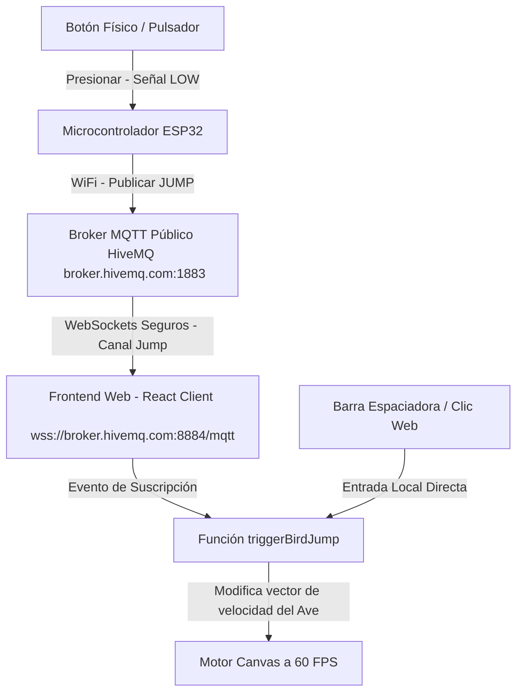

# 🎮 Flappy Bird IoT: Hardware Edition

Este proyecto es un clon completo, jugable y responsivo de **Flappy Bird** desarrollado con **React (Vite)**, **Tailwind CSS v4** y **MQTT (WebSockets)**. Está diseñado específicamente para ser controlado de forma remota y con bajísima latencia a través de hardware físico (como un microcontrolador **ESP32** con un botón pulsador) o de forma local mediante el teclado.

---

## 🛠️ Arquitectura del Sistema

La comunicación del sistema sigue un modelo de publicación/suscripción desacoplado e impulsado por eventos para lograr una latencia mínima de respuesta visual (menos de 80ms de retraso de extremo a extremo).



### Componentes de Software:
1. **Frontend (React & HTML5 Canvas)**: 
   - El juego se renderiza en un elemento `<canvas>` utilizando un loop dedicado alimentado por `requestAnimationFrame` que asegura una tasa de refresco constante de 60 cuadros por segundo.
   - Para maximizar el rendimiento, el estado del juego (posición del ave, obstáculos, partículas) se almacena en referencias de React (`useRef`). Esto evita la sobrecarga del ciclo de vida y re-renderizados de React durante la fase de juego activo.
2. **Cliente MQTT (WebSockets en el Navegador)**:
   - Implementado mediante la biblioteca `mqtt` para Node/Browser.
   - Se conecta por el puerto seguro `8884` usando TLS/SSL para evadir las restricciones de contenido mixto de los navegadores modernos (`wss://`).
   - Escucha mensajes de texto plano en el tópico: `workshop/flappy_bird/jump`.
3. **Firmware IoT (C++ Arduino)**:
   - Corre en el microcontrolador ESP32, encargándose de monitorear un pin GPIO en modo Pull-Up y realizar el antirebote (debounce) del pulsador antes de enviar la señal.

---

## 🔌 Esquema de Conexiones del Hardware

El circuito eléctrico requerido para conectar el botón al ESP32 es sumamente simple, ya que se utiliza la resistencia interna del chip mediante la instrucción `INPUT_PULLUP`.

### Componentes Requeridos:
- 1x Microcontrolador **ESP32** (o ESP8266/NodeMCU).
- 1x Botón pulsador táctil de dos o cuatro pines.
- 1x Protoboard y cables de conexión (Jumpers).
- Cable micro-USB o tipo C para programar y alimentar el microcontrolador.

### Diagrama del Circuito (ASCII):
```text
           +-----------------------------+
           |           ESP32             |
           |                             |
           |    [GND]            [GPIO4] |
           +------|-----------------|----+
                  |                 |
                  |             +---+---+
                  |             |       |
                  |          [ BOTÓN ]  |
                  |             |       |
                  |             +---+---+
                  +-----------------+
```
* **Conexión**:
  - Conecta un terminal del botón al pin **GPIO4** del ESP32.
  - Conecta el otro terminal del botón al pin **GND** (Tierra) del ESP32.
  - *Opcional*: Si usas un botón de 4 terminales, asegúrate de utilizar terminales diagonalmente opuestos para evitar cortocircuitos permanentes.

---

## 💾 Código del Firmware (ESP32)

Copia este código y cárgalo en tu ESP32 utilizando el **Arduino IDE** o **PlatformIO**. 

> [!TIP]
> **¿Tu PC no reconoce la placa al conectarla por USB?**  
> Si al conectar tu ESP32 a la computadora no se detecta ningún puerto COM en tu IDE, es probable que requieras instalar los controladores del puente USB a UART. Puedes descargar e instalar los drivers oficiales desde aquí:  
> 🔗 [Silicon Labs CP210x USB to UART Bridge VCP Drivers](https://www.silabs.com/software-and-tools/usb-to-uart-bridge-vcp-drivers?tab=downloads)

### Dependencias del IDE de Arduino:
1. Ve a **Herramientas > Administrar Bibliotecas**.
2. Busca e instala la librería **PubSubClient** (de Nick O'Leary).
3. Asegúrate de tener seleccionado el paquete de tarjetas correcto para **ESP32 Dev Module**.

```cpp
/**
 * Flappy Bird IoT - Jump Controller
 * Dispara el salto del ave publicando un mensaje en el broker MQTT de HiveMQ.
 */

#include <WiFi.h>
#include <PubSubClient.h>

// --- Ajustes de Red y Comunicación ---
const char* ssid = "TU_WIFI_SSID";             // Reemplaza con tu nombre de red
const char* password = "TU_WIFI_PASSWORD";     // Reemplaza con tu clave de red
const char* mqtt_server = "broker.hivemq.com"; // Broker público de HiveMQ
const int mqtt_port = 1883;                    // Puerto TCP estándar para MQTT
const char* topic = "workshop/flappy_bird/jump";

// --- Configuración de Pines ---
const int BUTTON_PIN = 4; // Pin GPIO4 conectado al pulsador
int lastButtonState = HIGH;
unsigned long lastDebounceTime = 0;
const unsigned long debounceDelay = 50; // Tiempo de antirebote en milisegundos

WiFiClient espClient;
PubSubClient client(espClient);

void setup_wifi() {
  delay(10);
  Serial.println();
  Serial.print("Conectando a ");
  Serial.println(ssid);

  WiFi.begin(ssid, password);

  while (WiFi.status() != WL_CONNECTED) {
    delay(500);
    Serial.print(".");
  }

  randomSeed(micros());
  Serial.println("");
  Serial.println("WiFi conectado exitosamente");
  Serial.print("Direccion IP: ");
  Serial.println(WiFi.localIP());
}

void reconnect() {
  // Loop hasta reconectar con el broker MQTT
  while (!client.connected()) {
    Serial.print("Intentando conexion MQTT...");
    // Generar un ID de cliente aleatorio único
    String clientId = "ESP32Client-" + String(random(0xffff), HEX);
    
    if (client.connect(clientId.c_str())) {
      Serial.println("¡Conectado al Broker!");
    } else {
      Serial.print("Fallo de conexion, rc=");
      Serial.print(client.state());
      Serial.println(". Reintentando en 5 segundos...");
      delay(5000);
    }
  }
}

void setup() {
  // Configurar el pin del botón con resistencia de pull-up interna activa
  pinMode(BUTTON_PIN, INPUT_PULLUP);
  
  Serial.begin(115200);
  setup_wifi();
  
  client.setServer(mqtt_server, mqtt_port);
}

void loop() {
  if (!client.connected()) {
    reconnect();
  }
  client.loop();

  // Lectura del pin del botón
  int reading = digitalRead(BUTTON_PIN);

  // Comprobación de estado lógico de caída (Físico presionado)
  if (reading == LOW && lastButtonState == HIGH) {
    if ((millis() - lastDebounceTime) > debounceDelay) {
      // Registrar salto
      Serial.println("Boton presionado físicamente. Publicando JUMP...");
      client.publish(topic, "JUMP");
      lastDebounceTime = millis();
    }
  }
  lastButtonState = reading;
}
```

---

## 💻 Instalación y Ejecución del Frontend

Sigue estos pasos para levantar el entorno web localmente en tu computadora.

### Requisitos Previos:
- Tener instalado [Node.js](https://nodejs.org/) (versión 18 o superior).

### Paso 1: Instalar dependencias
En la carpeta raíz del proyecto (`Workshop`), ejecuta:
```bash
npm install
```

### Paso 2: Ejecutar en modo desarrollo
Levanta el servidor local con Hot Module Replacement (HMR) mediante:
```bash
npm run dev
```
Abre tu navegador en la dirección local indicada por la consola (generalmente `http://localhost:5173`).

### Paso 3: Compilar para Producción
Para generar los archivos estáticos listos para desplegar en plataformas de hosting como Vercel, Netlify o GitHub Pages, corre:
```bash
npm run build
```
Los archivos optimizados y minificados se generarán en la carpeta `dist/`.

---

## 🎯 Características Destacadas del Juego

- **Dificultad Progresiva**: La velocidad y cadencia de generación de los obstáculos están ajustadas para proporcionar un reto equilibrado.
- **Física Fidedigna**: La inercia de caída, aceleración por gravedad y velocidad angular de rotación emulan de forma precisa la jugabilidad del título original de Dong Nguyen.
- **Micro-animaciones Premium**:
  - Al saltar, el ave expulsa pequeñas nubes de partículas de aire hacia atrás.
  - Al colisionar, se genera una explosión radial de 25 plumas con físicas gravitacionales y degradado de color (amarillo/naranja).
  - Efectos visuales de puntaje flotante (`+1`) que flotan y se desvanecen tras superar un tubo.
- **Doble Entrada**: Puedes probar de inmediato presionando la tecla **Espacio** de tu teclado si no tienes un ESP32 a la mano.
- **Simulador de MQTT**: El dashboard web incluye un botón gigante de simulación de señal de hardware. Al presionarlo, el cliente web publica de forma autónoma el mensaje `"JUMP"` en el broker, validando el funcionamiento del WebSocket seguro de HiveMQ.
- **Consola de Telemetría**: Panel de terminal retro que muestra el historial de conexión del cliente de mensajería e imprime los comandos de salto con milisegundos de precisión.
- **Almacenamiento Local (Local Storage)**: Los puntajes más altos del jugador persisten en el navegador.

---

## 🔧 Solución de Problemas al Cargar el Código al ESP32

Si al intentar cargar el código a la placa desde el Arduino IDE encuentras el siguiente error en la consola:

```text
El Sketch usa 911323 bytes (69%) del espacio de almacenamiento de programa. El máximo es 1310720 bytes.
Las variables Globales usan 46800 bytes (14%) de la memoria dinámica, dejando 280880 bytes para las variables locales. El máximo es 327680 bytes.
esptool v5.3.0
Serial port COM8:
Connecting......................................

A fatal error occurred: Failed to connect to ESP32: Wrong boot mode detected (0x13)! The chip needs to be in download mode.
For troubleshooting steps visit: https://docs.espressif.com/projects/esptool/en/latest/troubleshooting.html
Failed uploading: uploading error: exit status 2
```

¡Ese mensaje significa que tu código compiló a la perfección! La buena noticia es que el software está 100% listo. El único detalle ahora es físico: el chip del ESP32 no se enteró de que le ibas a meter código nuevo porque no entró en modo de descarga (*download mode*).

El error `Wrong boot mode detected (0x13)` ocurre porque algunas placas de desarrollo no logran realizar el auto-reset automáticamente debido a variaciones en la energía del puerto USB, capacitancia o el cable de datos.

### Pasos exactos para solucionarlo mediante el botón físico:

1. Presiona nuevamente el botón de **Subir** (la flecha a la derecha ➜) en el Arduino IDE.
2. Observa con atención la consola del IDE. En cuanto veas que vuelve a aparecer la línea de puntos de conexión:  
   `Connecting......................................`
3. En ese preciso instante, mantén presionado el botón que dice **"BOOT"** (o **"BOOT/IO0"**) en tu placa ESP32.
4. No lo sueltes hasta que veas que el texto en la consola cambia y dice algo como `Writing at 0x00001000...` o empiece a mostrar el progreso de subida en porcentaje.
5. En cuanto comience a escribir en la memoria flash, ya puedes soltar el botón y dejar que el proceso termine al 100%.

